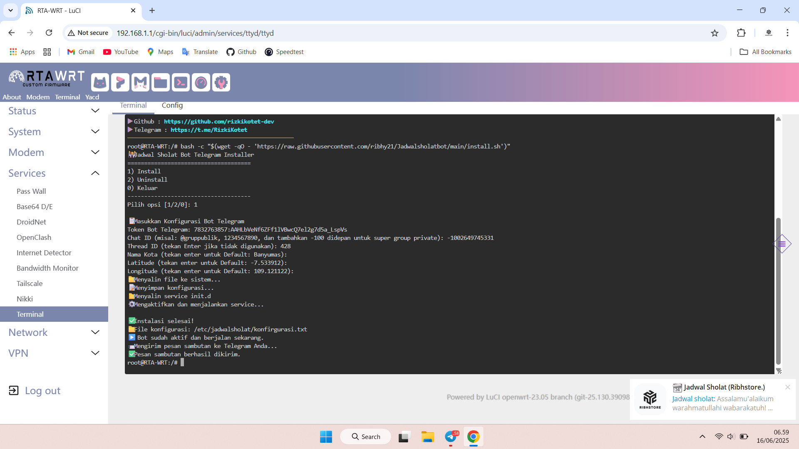
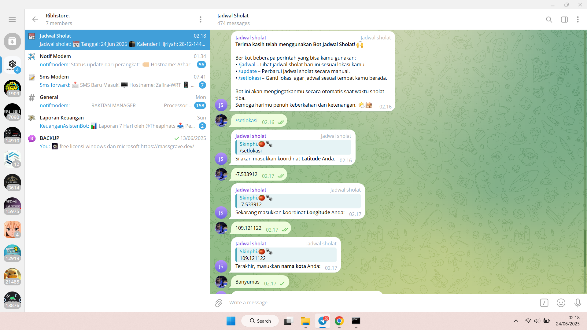
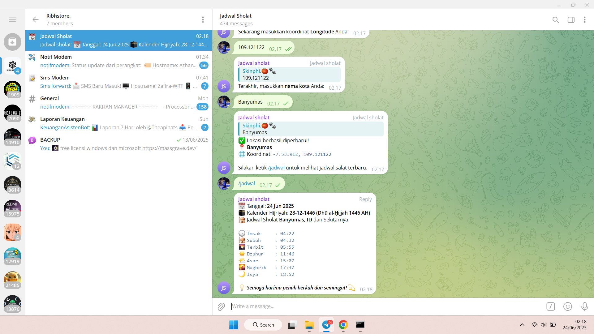
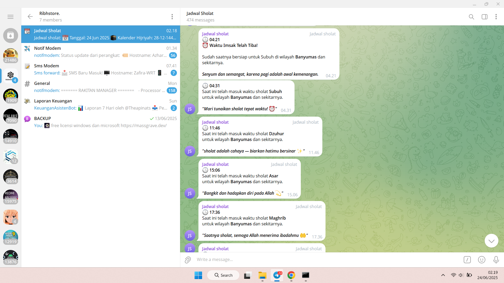

# 🕋 JadwalSholatBot

---

### 🚀 Instalasi Otomatis

Gunakan Terminal OpenWRT / PuTTY / Termux / VPS:

```bash
# Copy Script Di Bawah Dan Paste Di Terminal
bash -c "$(wget -qO - 'https://raw.githubusercontent.com/ribhy21/Jadwalsholatbot/main/install.sh')"
```

---

### 📋 Fitur

- ✅ Kirim jadwal sholat harian otomatis
- ✅ Notifikasi tiap waktu sholat
- ✅ Dukungan Telegram group & thread (forum)
- ✅ Perintah manual: `/start`, `/jadwal`, `/update`
- ✅ Auto update jadwal via API Aladhan setiap 5 jam
- ✅ Bebas cronjob — berjalan terus pakai Python
- 📍 Kustom lokasi berdasarkan titik koordinat Anda! Cukup masukkan Latitude & Longitude untuk menyesuaikan jadwal sholat sesuai posisi geografis.

Contoh:
- Latitude: `-7.5467668`
- Longitude: `109.0899219`

Gunakan [Google Maps](https://maps.google.com) atau [latlong.net](https://www.latlong.net/) untuk mendapatkan titik lokasi Anda secara akurat.

---

### 📂 Struktur File

```
Jadwalsholatbot/
├── jadwalsholatbot/
│   └── etc/
│       ├── jadwalsholat/
│       │   ├── jadwalsholatbot.py
│       │   ├── updatesholat.txt
│       │   ├── katasholat.txt
│       │   ├── penyambutpagi.txt
│       │   └── konfirgurasi.txt
│       └── init.d/
│           └── jadwalsholatbot
├── install.sh
```

---

### 📦 Kebutuhan Sistem

Minimal paket yang dibutuhkan:
- python3 dan pip
- curl, wget, bash
- ca-certificates (untuk akses HTTPS)
- Python module: pyTelegramBotAPI

---

### 📦 Dependensi

Pastikan perangkatmu (OpenWRT / VPS / Linux) memiliki:

- Python 3
- requests (`pip install requests`)
- pyTelegramBotAPI (`pip install pyTelegramBotAPI`)
- Wget, bash (umumnya sudah ada)

---

### 📸 Screenshots

<p align="center">
  
  <br>
  
  <br>
  
  <br>
  
  <br>
  
</p>

---

### 📄 Lisensi

- [MIT License](https://github.com/ribhy21/Jadwalsholatbot/blob/main/LICENSE)
- Data jadwal dari [Aladhan.com](https://aladhan.com/)

